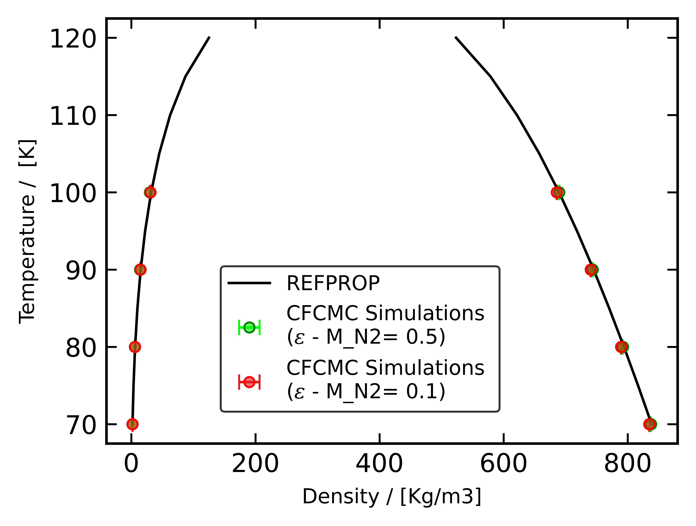

# Transferable Potentials for Phase Equilibria (TraPPE)

## Nitrogen (small)

**Chemical Formula:** N₂  
**Molecular Weight:** **28.01**  
**Smiles String:** N#N

### Bond Lengths

| #  | Stretch | Type   | Length [Å] |
|----|---------|--------|------------|
| 1  | 1 – 3   | N#N    | 1.10       |
| 2  | 1 – 2   | N#M    | 0.55       |
| 3  | 2 – 3   | N#M    | 0.55       |

### Bond Angles

| #  | Bend    | Type       | $\theta$ [°] |
|----|---------|------------|--------------|
| 1  | 1 – 2 – 3 | N#(M)#N  | 180.00       |

This model was developed as part of the $N_2$ TraPPE - Flexible parameterization process.

## Monte-Carlo
### The epsilon paramter is fixed for N which is 36/K which is the original parameter form the FF
### N2_TRAPPE_FLEX-36 (Original)
| Atom     | Sigma | Epsilon | Charge | LJ? | EL? | Print   |
|----------|--------|---------|--------|-----|-----|--------|
| N_N2_T   | 3.310  | 36.0 [original parameter]   | -0.482  | T   | T   | N2     |
| M_N2_T   | 0.1    | 0.1     | 0.964  | T   | T   | N2_X   |

### Choice between the sigma and epsilon paramters of the dummy site is decided here 

### Folder = N2_TRAPPE_FLEX-36-1
| Atom     | Sigma | Epsilon | Charge | LJ? | EL? | Print   |
|----------|--------|---------|--------|-----|-----|--------|
| N_N2_T   | 3.310  | 36.0    | -0.482 | T   | T   | N2     |
| M_N2_T   | 0.1    | 0.1     | 0.964  | T   | T   | N2_X   |

### Folder = N2_TRAPPE_FLEX-36-5
| Atom     | Sigma | Epsilon | Charge | LJ? | EL? | Print |
|----------|--------|---------|--------|-----|-----|--------|
| N_N2_T   | 3.310  | 36.0    | -0.482 | T   | T   | N2     |
| M_N2_T   | 0.5    | 0.5     | 0.964  | T   | T   | N2_X   |

### The bond constant remains unchnaged for both the direcotries
### Bending Parameters

| Bending Type | θ₀ (deg) | K (kJ/mol·rad²) | Δθ (deg) |
|--------------|----------|------------------|----------|
| N2_N_M_N     | 180      | 100643.91473     | 10       |

## RELATIVE Deviation

### Liquid Density Comparison: MC vs NIST
### N2_TRAPPE_FLEX-36-1
| Temperature (K) | Liquid Density (kg/m³) - MC | Liquid Density (kg/m³) - NIST | RD (%) |
|------------------|------------------------------|---------------------------------|--------|
| 70               | 834.64                       | 838.51                          | 0.46   |
| 80               | 789.19                       | 793.94                          | 0.59   |
| 90               | 740.29                       | 745.02                          | 0.63   |
| 100              | 685.59                       | 689.35                          | 0.54   |

### N2_TRAPPE_FLEX-36-5

### Liquid Density Comparison (Updated): MC vs NIST

| Temperature (K) | Liquid Density (kg/m³) - MC | Liquid Density (kg/m³) - NIST | RD (%)  |
|------------------|------------------------------|---------------------------------|---------|
| 70               | 837.50                       | 838.51                          | 0.12    |
| 80               | 792.25                       | 793.94                          | 0.21    |
| 90               | 743.63                       | 745.02                          | 0.19    |
| 100              | 689.50                       | 689.35                          | 0.022   |
