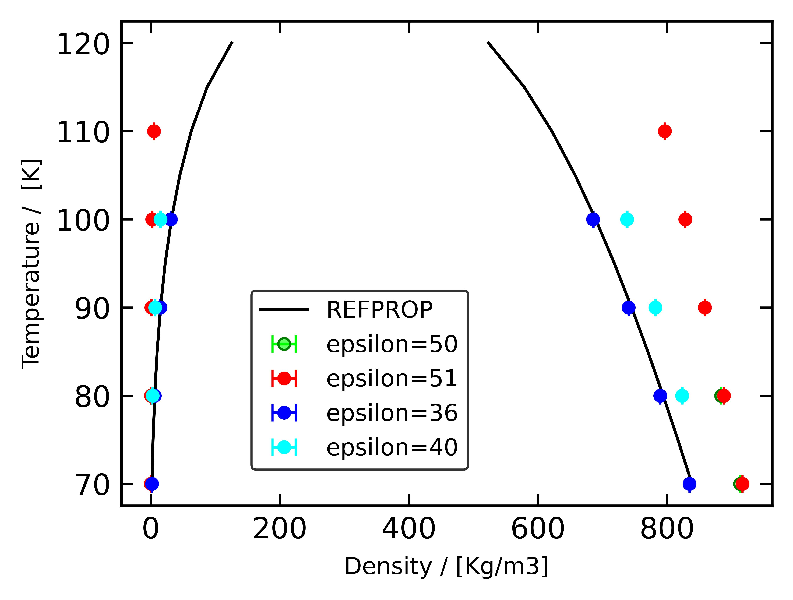

# Transferable Potentials for Phase Equilibria (TraPPE)

## Nitrogen (small)

**Chemical Formula:** N₂  
**Molecular Weight:** **28.01**  
**Smiles String:** N#N

### Bond Lengths

| #  | Stretch | Type   | Length [Å] |
|----|---------|--------|------------|
| 1  | 1 – 3   | N#N    | 1.10       |
| 2  | 1 – 2   | N#M    | 0.55       |
| 3  | 2 – 3   | N#M    | 0.55       |

### Bond Angles

| #  | Bend    | Type       | $\theta$ [°] |
|----|---------|------------|--------------|
| 1  | 1 – 2 – 3 | N#(M)#N  | 180.00       |

---

### Simulation Data
#### Liquid and Critical Properties

- $T_\text{critical}$ = 126.5 K  
- $\rho_\text{critical}$ = 0.3080 g/ml

This model was developed as part of the $N_2$ TraPPE - Flexible parameterization process.

## Functional Forms and Parameters

### Monte-Carlo

---

### N2_TRAPPE_FLEX-1
| Atom     | Sigma | Epsilon | Charge | LJ? | EL? | Print |
|----------|--------|---------|--------|-----|-----|--------|
| N_N2_T   | 3.310  | 50.0    | -0.482 | T   | T   | N2     |
| M_N2_T   | 0.5    | 0.5     | 0.964  | T   | T   | N2_X   |

---

### N2_TRAPPE_FLEX-2
| Atom     | Sigma | Epsilon | Charge | LJ? | EL? | Print |
|----------|--------|---------|--------|-----|-----|--------|
| N_N2_T   | 3.310  | 51.0    | -0.482 | T   | T   | N2     |
| M_N2_T   | 0.5    | 0.5     | 0.964  | T   | T   | N2_X   |

---

### N2_TRAPPE_FLEX-3
| Atom     | Sigma | Epsilon | Charge | LJ? | EL? | Print |
|----------|--------|---------|--------|-----|-----|--------|
| N_N2_T   | 3.310  | 52.0    | -0.482 | T   | T   | N2     |
| M_N2_T   | 0.5    | 0.5     | 0.964  | T   | T   | N2_X   |

---

### N2_TRAPPE_FLEX-4
| Atom     | Sigma | Epsilon | Charge | LJ? | EL? | Print |
|----------|--------|---------|--------|-----|-----|--------|
| N_N2_T   | 3.310  | 53.0    | -0.482 | T   | T   | N2     |
| M_N2_T   | 0.5    | 0.5     | 0.964  | T   | T   | N2_X   |

---

### N2_TRAPPE_FLEX-5
| Atom     | Sigma | Epsilon | Charge | LJ? | EL? | Print |
|----------|--------|---------|--------|-----|-----|--------|
| N_N2_T   | 3.310  | 54.0    | -0.482 | T   | T   | N2     |
| M_N2_T   | 0.5    | 0.5     | 0.964  | T   | T   | N2_X   |

---

### N2_TRAPPE_FLEX-40
| Atom     | Sigma | Epsilon | Charge | LJ? | EL? | Print |
|----------|--------|---------|--------|-----|-----|--------|
| N_N2_T   | 3.310  | 40.0    | -0.482 | T   | T   | N2     |
| M_N2_T   | 0.1    | 0.1     | 0.964  | T   | T   | N2_X   |

---

### N2_TRAPPE_FLEX-45
| Atom     | Sigma | Epsilon | Charge | LJ? | EL? | Print |
|----------|--------|---------|--------|-----|-----|--------|
| N_N2_T   | 3.310  | 45.0    | -0.482 | T   | T   | N2     |
| M_N2_T   | 0.1    | 0.1     | 0.964  | T   | T   | N2_X   |

---

### N2_TRAPPE_FLEX-36 (Original)
| Atom     | Sigma | Epsilon | Charge | LJ? | EL? | Print |
|----------|--------|---------|--------|-----|-----|--------|
| N_N2_T   | 3.310  | 36.0 [original parameter]   | -0.482 | T   | T   | N2     |
| M_N2_T   | 0.1    | 0.1     | 0.964  | T   | T   | N2_X   |

