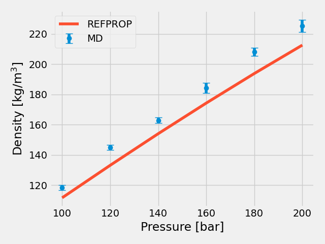
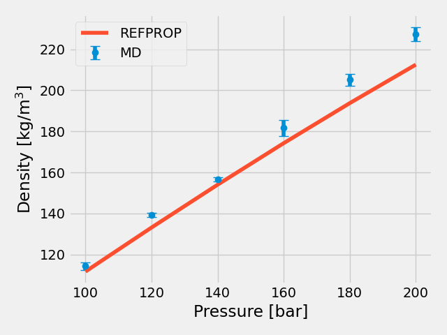

# Transferable Potentials for Phase Equilibria (TraPPE)

## Nitrogen (small)

**Chemical Formula:** N₂  
**Molecular Weight:** **28.01**  
**Smiles String:** N#N

### Bond Lengths

| #  | Stretch | Type   | Length [Å] |
|----|---------|--------|------------|
| 1  | 1 – 3   | N#N    | 1.10       |
| 2  | 1 – 2   | N#M    | 0.55       |
| 3  | 2 – 3   | N#M    | 0.55       |

### Bond Angles

| #  | Bend    | Type       | $\theta$ [°] |
|----|---------|------------|--------------|
| 1  | 1 – 2 – 3 | N#(M)#N  | 180.00       |

---

### Simulation Data

#### Liquid and Critical Properties

- $T_\text{critical}$ = 126.5 K  
- $\rho_\text{critical}$ = 0.3080 g/ml

This model was developed as part of the $N_2$ TraPPE - Flexible parameterization process.

### Functional Forms and Parameters
## Folder = T_300
# TraPPE Flexible Force Field for N₂

This force field defines a **TraPPE flexible model** for nitrogen (N₂) used in molecular simulations. The parameters include non-bonded interactions, bond and angle potentials, and atomic charges.

## Force Field Parameters

```lammps
#----------------------------------------------------------------------------#
# FORCEFIELD - TraPPE Flexible model for N2
#----------------------------------------------------------------------------#

pair_coeff      1   1  0.071539  3.310  # [N2]-L-[N2]
pair_coeff      2   2  0.0009936 0.5    # N2-[L]

bond_coeff      1   500 0.55            # [N2]-[L]

angle_coeff     1   50 180              # N2-N2_X-N2

mass 1 13.9067      # N2  
mass 2  0.1         # N2_X

set type        1   charge     -0.482   # N2  
set type        2   charge      0.964   # N2_X
```


## 5 % Relative Deviation (epsilon-36)

## Folder = T_300_1
```lammps
#----------------------------------------------------------------------------#
# FORCEFIELD - TraPPE Flexible model for N2
#----------------------------------------------------------------------------#

pair_coeff      1   1  0.0695521435  3.310  # [N2]-L-[N2]
pair_coeff      2   2  0.0009936 0.5   # N2-[L]
 
bond_coeff      1   500 0.55            # [N2]-[L]

angle_coeff     1   50 180              # N2-N2_X-N2

mass 1 13.9067      # N2
mass 2  0.1         # N2_X

set type        1   charge     -0.482             # N2
set type        2   charge      0.964             # N2_X
```



